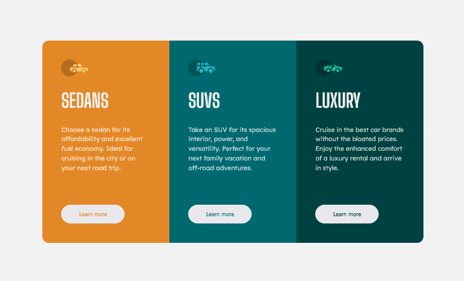

# Frontend Mentor - 3-column preview card component solution

This is a solution to the [3-column preview card component challenge on Frontend Mentor](https://www.frontendmentor.io/challenges/3column-preview-card-component-pH92eAR2-). Frontend Mentor challenges help you improve your coding skills by building realistic projects.

## Table of contents

- [Overview](#overview)
  - [The challenge](#the-challenge)
  - [Screenshot](#screenshot)
  - [Links](#links)
- [My process](#my-process)
  - [Built with](#built-with)
  - [What I learned](#what-i-learned)
- [Author](#author)

## Overview

### The challenge

Users should be able to:

- View the optimal layout depending on their device's screen size
- See hover states for interactive elements

### Screenshot

### Links

- Solution URL: [Github Repository](https://github.com/HectorKayman/three-column-preview-card-component)
- Live Site URL: [Github Pages](https://hectorkayman.github.io/three-column-preview-card-component/)

## My process

### Built with

- Semantic HTML5 markup
- CSS custom properties
- Flexbox
- CSS Grid
- Mobile-first workflow

### What I learned

I was able to match the asked requirements and the provided design much more accurately, buy the use of both Flexbox and Grid, used variables to avoid code duplication. Overall, it was a simple project and the completion time was faster too, compared to the previous challenges I had completed.

## Author

- Frontend Mentor - [@HectorKayman](https://www.frontendmentor.io/profile/HectorKayman)

---
